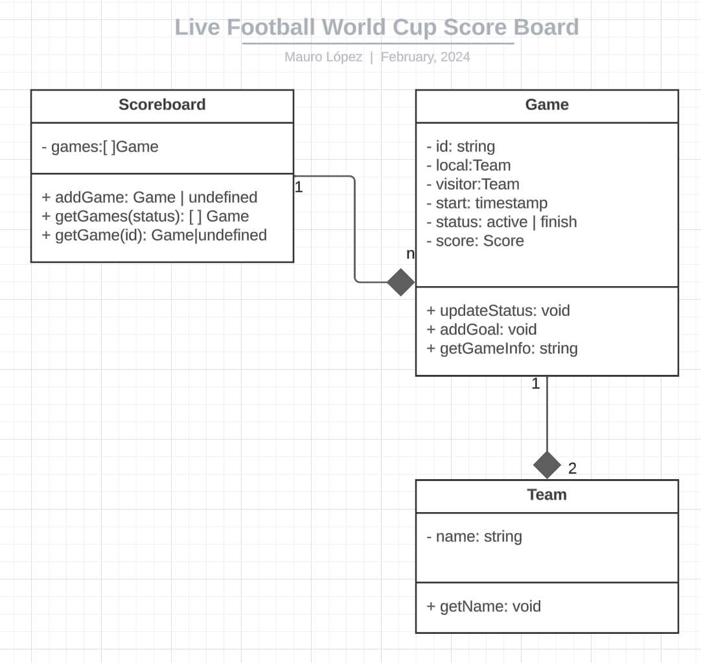

# Live Football World Cup Scoreboard


[](code_of_conduct.md)

A Live Football World Cup Scoreboard library that shows all the ongoing matches and their scores.

## Installation

```
npm ci
```

## Running tests

```
npm test
```

## Operations supported

| Operation                            | About                                                                                                                                                                                                                                                                                                                                                                       |
| ------------------------------------ | --------------------------------------------------------------------------------------------------------------------------------------------------------------------------------------------------------------------------------------------------------------------------------------------------------------------------------------------------------------------------- |
| Start a new match                    | When initing a new match, the initial score is 0 for the local team and 0 for the visitor team. When created, the new match is visible in the scoreboard.                                                                                                                                                                                                                   |
| Update score                         | It is possible to update the score of the match. Value to update the score must be a whole number.                                                                                                                                                                                                                                                                          |
| Finish match currently in progress   | It is possible to finish a match that is currently in progress. By this action, the match is removed from the scoreboard.                                                                                                                                                                                                                                                   |
| Get a summary of matches in progress | It is possible to get a summary of the matches that are in progress. The information is orderer by total score, presenting first the match with more goals. If matches have same amount of goals, the most recently started is returned first. This operation can be implementing any time as far as there is a scoreboard. Only matches that are in progress are returned. |

See [./src/index.spec.ts](./src/index.spec.ts) for more information.

# Example of usage

```TypeScript
import { MatchError, TeamError, Tournament, TournamentError } from "./src/index";

try {
  // create tournament
  const worldCup = new Tournament("Fifa World Cup 2024");

  // create teams
  const CRC = worldCup.createTeam("CRC");
  const NOR = worldCup.createTeam("NOR");

  // add teams to the tournament
  worldCup.addTeam(CRC).addTeam(NOR);

  // create match                local - visitor
  worldCup.addMatch(CRC, NOR); // CRC vs NOR

  // print live scoreboard
  console.log(worldCup.liveScoreboard); // [CRC 0 - 0 NOR]

  // Goal: CRC 1 - 0 NOR
  worldCup.getMatch(CRC, NOR)?.setGoal(1, 0);
  // print live scoreboard
  console.log(worldCup.liveScoreboard); // [CRC 1 - 0 NOR]

  // Goal: CRC 1 - 1 NOR
  worldCup.getMatch(CRC, NOR)?.setGoal(0, 1);
  // print live scoreboard
  console.log(worldCup.liveScoreboard); // [CRC 1 - 1 NOR]

  // finish the match
  worldCup.finishMatch(CRC, NOR);
  // print live scoreboard
  console.log(worldCup.liveScoreboard); // []
} catch (error) {
  if (error instanceof TeamError) {
    console.log(error);
    // manage your error here
  }
  if (error instanceof MatchError) {
    console.log(error);
    // manage your error here
  }
  if (error instanceof TournamentError) {
    console.log(error);
    // manage your error here
  }
}

```

See [./src/example.ts](./src/example.ts) for an example with more teams. Run the following command to execute [./src/example.ts](./src/example.ts) :

```
npm run example
```

# UML class diagram



# Application decision records

See [./appdrs](./appdr/README.md)

# Architecture decision records

See [./adr](./adr/README.md)
